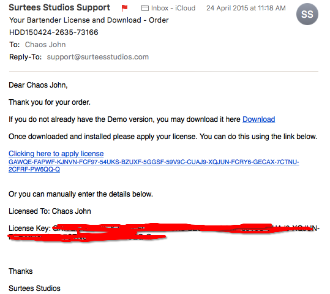
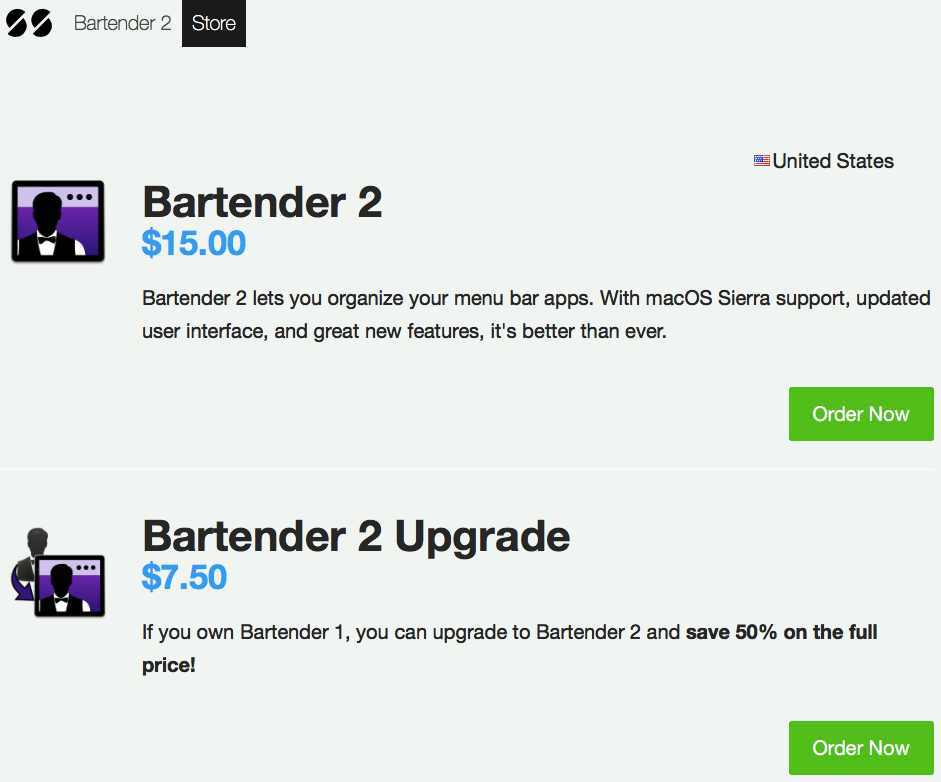
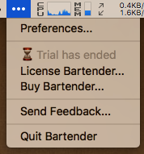
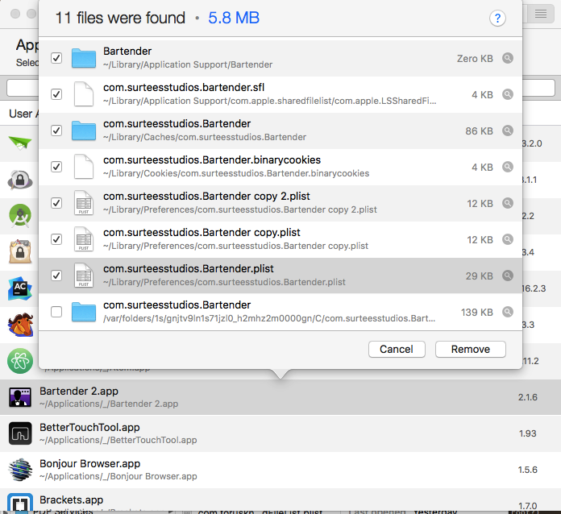
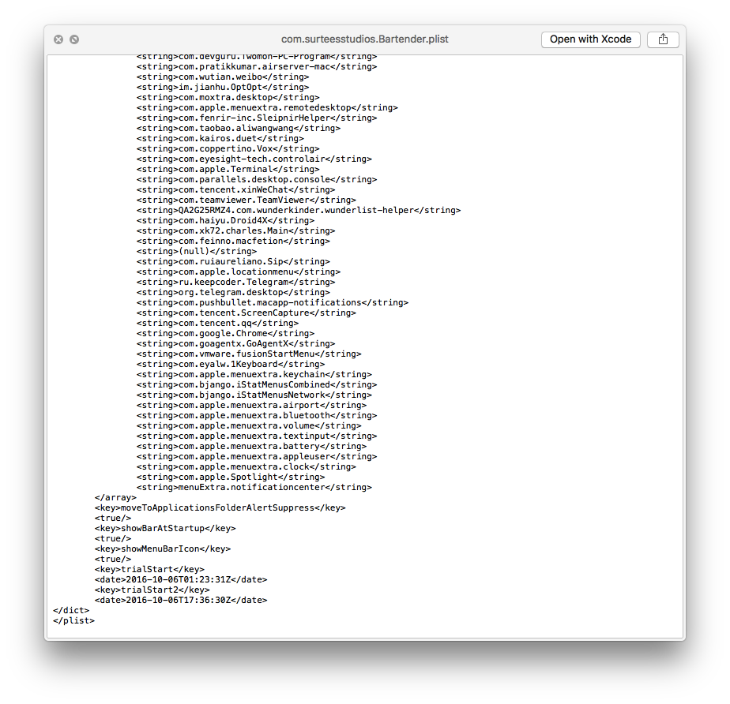
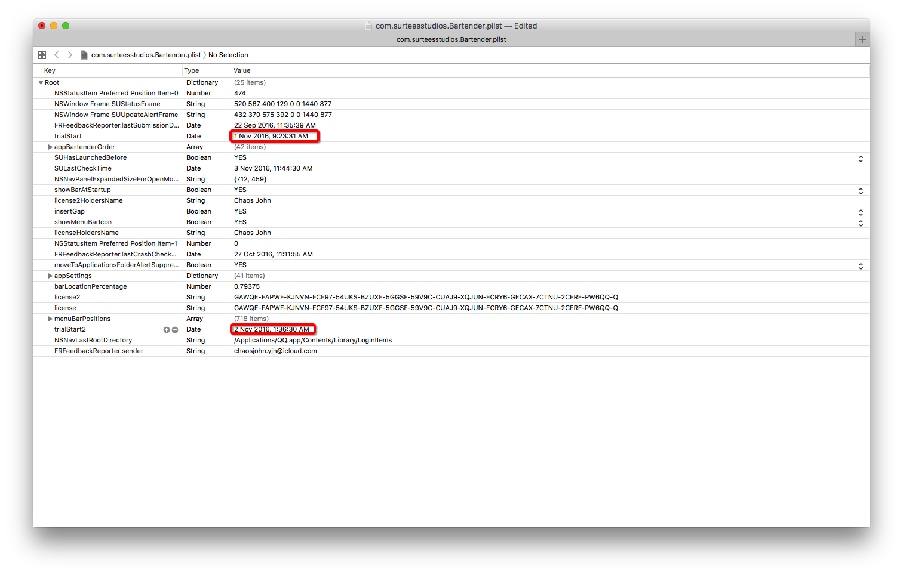
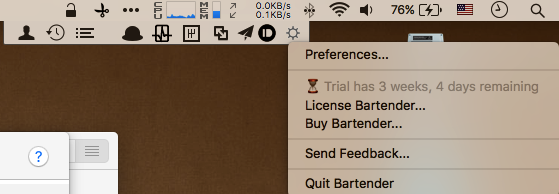

title: 破解Mac菜单栏神器 -- Bartender2
date: 2016-11-04 14:59:31
tags: [Crack, Software]
---
 

[欢迎转载，但请在开头或结尾注明原文出处【blog.chaosjohn.com】](https://blog.chaosjohn.com/Crack-Bartender2.html)

## 题外话
真的好久好久没有更新blog了，上篇博客还是今年5月30号。虽然好几次想更两篇，但是。。。懒癌晚期。。。哈哈哈，废话不多说，进入正文。

## 软件介绍 
Bartender是一款管理mac菜单栏图标的软件，笔者的mac装了很多很多的应用，很多都会在菜单栏里停驻一个图标，然后顶部的菜单栏悲剧的挤满了。。。用Windows的童鞋都知道，在桌面任务栏右下角都会有一箭头，收起时只显示几个常驻的图标，点击后其他隐藏的图标才会出现。一直搞不明白为什么苹果原生不能增加一个这样的功能呢？应该也不是什么难事呀！Bartender实现的就是这个功能。关于Bartender的详细介绍移步[少数派](https://sspai.com/28887v)

## 破解的缘由
* 笔者其实很愿意为软件花钱（前提是在承受范围内哈哈哈），自打大四进入工作以来，在各类软件&服务上花的钱也有一两千了。比如，Bartender第一代，我就花了$15。然后就一直使用到今年，一直相安无事，直到Bartender出了第二代，优化了界面显示以及加了些小功能，但是都没戳中我痛点，所以就一直没有去改用Bartender2。
* 但是，9月下旬mac更新了操作系统macOS Sierra，升级完很悲剧的发现，Bartender1已经不兼容改操作系统了，而且显然，作者把重心放在了Bartender2上，估计也不会更新Bartender1了。不得已，只好卸载了1安装上了2。结果发现，1的序列号不能再2上使用，得重新购买($15)或者从1升级到2($7.5)。。。天杀的！！！ 
* 还好有4个星期的试用期，就先用着了。。。但是用着一个会到期的服务，那感觉，就像头上悬着把刀，很不是滋味。。。于是我就开始思考：它是怎么计算试用时间的？
* 一番捣鼓后，试用时间被我成功重置，但是不知道这个漏洞会不会被封堵掉，所以直到今天被我再次重置后(期间Bartender2已经升级了好几个版本)，我才确定了我的破解方法的可行性。

## 破解过程
* 假设Bartender2试用时间已过期
* 
* 关闭Bartender2，打开AppCleaner，找到Bartender2那项，点击它，会弹出一个窗口，里面会罗列出与该应用相关的所有配置文件等等。
* 经猜测锁定"com.surteesstudio.Bartender.plist"，打开翻到最后，果然看到“trialStart”这样的字样，哈哈哈。
* 用编辑器打开(笔者用的XCode，因为上次直接用Vim编辑保存后Bartender不能识别），把"trialStart"和"trialStart2"改成当前日期的前两天. 
* 大功告成 

## 结语
最后，如果该文对读者有些许帮助，考虑下给点捐助鼓励一下呗😊

