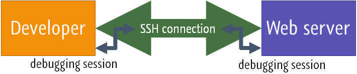
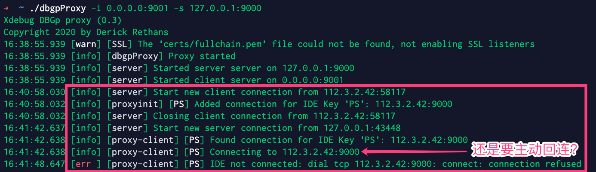

[欢迎转载，但请在开头或结尾注明原文出处【blog.chaosjohn.com】](https://blog.chaosjohn.com/Debug-php-continued.html)

## 前言
在前文 [php 调试指南（Xdebug版）](https://blog.chaosjohn.com/Debug-php.html) 开头，笔者吹了一句 ”吃透本文，没有人将比你更懂 Php Xdebug 调试“。没想到打脸来的如此之快，这才过了三四天，我发现今天的我比写前文时的我，**更懂** 了。

## 关于 PhpStorm 2020.3 和 Xdebug 3
在前文中，笔者用的还是 `PhpStorm 2020.2.4`，所以结合 `Xdebug 3.0.0` 在使用 `Web Server Debug Validation` 进行 **调试环境验证** 时，提示类似 `Xdebug port is invalid` 的报错，分析是 **不兼容 3.0.0 版本** 导致的。所以降级成了 `Xdebug 2.9.8` 才顺利写完了文章。

写完前文的第二天，[PhpStorm 2020.3就发布了](https://confluence.jetbrains.com/display/PhpStorm/PhpStorm+2020.3+Release+Notes)，新增
- 对 `PHP 8` 的支持
- 对 `Xdebug 3` 的支持

在重新用 `PHPBrew` 安装 `PHP 8` **+** `Xdebug 3.0.0` 环境并且用 `Nginx` **+** `php-fpm` 部署起来后，`Web Server Debug Validation` 成功验证。

## 关于 `Web Server Debug Validation` 功能
笔者在前文写完后，在升级 `PhpStorm 2020.3` 之前，笔者重新安装了 `PHP 7.4.13` **+** `Xdebug 3.0.0` 环境，在忽略 `验证报错` 的情况下直接开启调试，是完全没有任何问题的。所以，该功能只是 `验证调试环境`，在调试之前仅作参考，不影响实际调试。

## 关于 `远程调试`
笔者在写前文关于 **远程调试** 的几节时，参考了网上很多文章，看似吃透了，其实不然，原因有这样几点：
- 网上很多文章的作者写文时也如同笔者写前文时一样，对原理一知半解，导致很多讲解其实不完善或者南辕北辙。正确的做法：研读 `JetBrains` / `VSCode` / `Xdebug` 的官方文档，去理解它的原理。
  - [Configure Xdebug—PhpStorm](https://www.jetbrains.com/help/phpstorm/configuring-xdebug.html) PhpStorm官方：配置 Xdebug
  - [Remote debugging via SSH tunnel—PhpStorm](https://www.jetbrains.com/help/phpstorm/remote-debugging-via-ssh-tunnel.html) PhpStorm官方：通过SSH隧道进行远程调试
  - [Multiuser debugging via Xdebug proxies—PhpStorm](https://www.jetbrains.com/help/phpstorm/multiuser-debugging-via-xdebug-proxies.html) PhpStorm官方：通过 Xdebug 代理进行多人调试
  - [PHP Debug Adapter for Visual Studio Code](https://marketplace.visualstudio.com/items?itemName=felixfbecker.php-debug) VSCode PHP Debug 插件主页文档
  - [Step Debugging](https://xdebug.org/docs/step_debug) Xdeubg官方：单步调试
  - [Documentation - all settings](https://xdebug.org/docs/all_settings) Xdebug官方：所有配置项
  - [Upgrading from Xdebug 2 to 3](https://xdebug.org/docs/upgrade_guide) Xdebug官方：从Xdebug 2 升级到 Xdebug 3
- 笔者写前文时搭建的 `远程调试环境` 不完善
  - **本机** 和 **远程服务器** 都是 `macOS`
  - **本机** 和 **远程服务器** 都在 `局域网内`

## `IDE` 结合 `Xdebug` 调试的原理
- `IDE（本身或利用插件）` 打开本地的 `9000` 端口并进行监听（Xdebug 2.X 默认为 `9000`，Xdebug 3.X 默认为 `9003`，但均可修改）
- `IDE（本身或利用插件）` 做好路径映射（`path mapping`），即本地在IDE中打开的项目目录与远程服务器上的项目目录做一一映射，例如
  - macOS 本地：`/Users/chaos/Work/php/demos/debug/`
  - Linux 服务器：`/home/chaos/Work/php/demos/debug/`
- 本地向服务器发送请求时带上 `Cookie: XDEBUG_SESSION=IDEKEY`
- 服务器接受到请求时，经历了 `Nginx` -> `php-fpm` 后到达 `Xdebug`，`Xdebug` 检测到 `XDEBUG_SESSION` 的 `cookie`，认为这条请求是带着 `调试目的` 来的，同时挂起 `PHP解释器` 进一步处理请求
- 然后 `Xdebug` 从 `php.ini` 中获取目标地址或从 `$_SERVER` 里获取到请求的来源地址（比如 `223.104.148.182`）作为目标地址，然后就向目标地址的 `9000` 端口发起建立 `调试连接`
- 本地的 `IDE（本身或利用插件）` 发现监听的 `9000` 端口有 `调试连接` 建立，判断一下 `XDEBUG_SESSION` 是否为自己预设的 `IDE key`
  - 如果不是预设 `IDE key`，通过 `9000` 端口上的 `调试连接` 告诉服务器的 `Xdebug`，“不归我管，我不处理”，然后双方协商一下断连接
  - 如果是预设 `IDE key`，同时发现本地打了断点或者本地设置了 `"stopOnEntry": true` (VSCode) / `Break at first line in PHP scripts` (PhpStorm)，则告诉服务器的 `Xdebug`，“收到，调试准备就绪”，然后双方协商一下进入调试状态


## 真实环境下 **远程调试** 的 `陷阱`
聪明的小伙伴可能已经发现上述 `调试流程` 里存在的一个 `陷阱`：即服务器要向本地请求建立 `调试连接`，但问题是，现在所有的 **家用/企业** 网络环境下，所谓的 `本地` 都在上级路由器的 `NAT` 下，根本就没有暴露在公网的 `IP地址`，所以 `本地` 的 `9000` 端口对于服务器来说，是不可达的，想要访问，做梦！

## 填坑 `陷阱`
笔者重新模拟了真实的调试环境，即 `本地` 为 `macOS`，`远程服务器` 选了两台 `Linux`，一台是笔者在公司搭建的 **物理机**，另一台是公司购买的阿里云 **云主机**。

填坑的最终目的，是要使得 `本地` 的 `9000` 端口暴露给服务器，让其直接可达。

这里分：
1. 本地和远程服务器同处一个局域网内，例如，都加入同一个 `VPN` 网络，本地通过 `VPN` 分配给服务器的 `私网IP` 访问服务器，服务器的 `Xdebug` 解析到的来源地址则也是通过 `VPN` 分配给本地的 `私网IP`，直接可达。
2. 路由器本身从 `ISP（宽带运营商）` 通过 `PPPoE 拨号` 获取到了 `公网IP`，然后路由器上通过 `端口映射` 或 `DMZ 模式`，将本地的 `9000` 端口，映射到路由器的 `9000` 端口，这样服务器也可通过 `公网IP:9000` 访问到本地的 `9000` 端口。（该方式最推荐，但是在国内可行度不高，因为国内 `IP地址池` 即将枯竭，所以很难从运营商处申请到 `公网IP`）
3. 其他环境只能借助 **移花接木大法**：借助 `SSH 反向隧道`，在本地和服务器之间建立一条 `TCP通道`，将本地的 `9000` 端口映射到服务器的 `9000` 端口。这样的话，服务器上的 `Xdebug` 访问 `localhost:9000` 就等于访问到了 `IDE本地` 的 `9000` 端口。（借用 JetBrains 官方文档里的一副插图）


在这里，笔者将前两种环境归纳为 `回程网络直接可达`，否则则为 `回程网络不可直达`。


## `PhpStorm` 的特殊配置
在分别罗列远程调试的具体参数配置之前，笔者还得额外将 `PhpStorm` 的特殊配置单独拎出来阐述一下。

`PhpStorm` 调试的 **目标服务器**，以 `Server` 的存在进行配置，具体位于 `偏好设置` 的 `Languages and Frameworks | PHP | Servers` 下。[详见 JetBrains 官方文档]()，原文是这样的：
> On this page, configure HTTP access for debugging engines to interact with local and remote Web servers and set correspondence between files on the server and their local copies in the PhpStorm project. 
> 
> 在本页，为调试配置 HTTP 访问，用以在 **本地** 和 **远程 Web 服务器** 之间交互，以及为 **远程服务器的文件** 与其在 **PhpStorm 工程** 中打开的 **本地拷贝** 设置关联。

`PhpStorm` 调试的特殊配置：在远程服务器上的 `php-fpm` 配置文件里添加这两行：
```
clear_env = no
env["PHP_IDE_CONFIG"] = "serverName=UbuntuServer"
```
这里 `UbuntuServer` 是自定义的服务器名称，自行更改。

然后在 `PhpStorm` 偏好设置的 `Languages and Frameworks | PHP | Servers` 添加一个 `Server`
- `name` 填 `UbuntuServer`
- `Host` 和 `Port` 笔者亲测可填任意合法值，`PhpStorm` 不校验，所以笔者都填写了 `0` 值
- `Debugger` 选择 `Xdebug`
- 勾选上 `Use path mappings`，并且设置好 `本地文件目录路径` 和 `服务器文件目录路径` 的映射（比如笔者本地的 `/Users/chaos/Work/php/demos/debug/` 与服务器的 `/home/chaos/Work/php/demos/debug/`）


## `VSCode` 的配置
只需要比本地调试多配置一个 `路径映射`，即 `pathMappings` 键值对，附上 `launch.json` 文件内容：
```
{
  "version": "0.2.0",
  "configurations": [
    {
      "name": "Listen for XDebug",
      "type": "php",
      "request": "launch",
      "port": 9000,
      // "stopOnEntry": true,
      "pathMappings": {
        "/home/chaos/Work/php/demos/debug/": "${workspaceRoot}/",
      }
    },
    {
      "name": "Launch currently open script",
      "type": "php",
      "request": "launch",
      "program": "${file}",
      "cwd": "${fileDirname}",
      "port": 9000
    }
  ]
}
```
这里的 `"/home/chaos/Work/php/demos/debug/": "${workspaceRoot}/"` 是 `"/home/chaos/Work/php/demos/debug/": "/Users/chaos/Work/php/demos/debug/"` 的简化形式，`${workspaceRoot}` 则为 `VSCode` 中打开的 `项目根目录`。

## 服务器的 `php.ini` 在不同情况下的配置
### 情况一：`回程网络直接可达`
- Xdebug 2.X
```
[xdebug]
xdebug.remote_enable=1
xdebug.remote_connect_back=1
```
> | `remote_enable=1` 表示开启远程调试
> 
> | `remote_connect_back=1` 表示获取请求发起地址（从 `$_SERVER['HTTP_X_FORWARDED_FOR']` 和 `$_SERVER['REMOTE_ADDR']` 中获取），反向访问发起地址的 `9000` 端口建立调试连接

- Xdebug 3.X
```
[xdebug]
xdebug.mode=debug
xdebug.discover_client_host=true
xdebug.port=9000
```
> | `mode=debug` 取代了 `2.X` 版本的 `remote_enable=1`
> 
> | `discover_client_host=true` 取代了 `2.X` 版本的 `xdebug.remote_connect_back=1`
> 
> | `port=9000` 是个人喜好，在 `3.X` 中默认为 `9003`。笔者倾向于保持与 `2.X` 一致，这样同一份 `IDE` 配置可以同时调试 `2.X` 版本和 `3.X` 版本

### 情况二：`回程网络不可直达`
先用 `SSH 隧道` 反向将本地的 `9000` 端口映射到服务器的 `9000` 端口上
```
ssh -g -N -R 9000:127.0.0.1:9000 user@server
```

- Xdebug 2.X (Method A)
```
[xdebug]
xdebug.remote_enable=1
xdebug.remote_host=127.0.0.1
```
> | `remote_host=127.0.0.1` 表示直接向 `127.0.0.1` 这个地址请求建立调试连接

- Xdebug 2.X (Method B)
```
[xdebug]
xdebug.remote_enable=1
xdebug.remote_connect_back=1
xdebug.remote_addr_header="HTTP_X_XDEBUG_REMOTE_ADDR"
```
> | `remote_connect_back=1` 表示获取请求发起地址，反向访问发起地址的 `9000` 端口建立调试连接
> 
> | `xdebug.remote_addr_header="HTTP_X_XDEBUG_REMOTE_ADDR"` 表示优先从 $_SERVER['HTTP_X_XDEBUG_REMOTE_ADDR'] 获取发起地址，获取不到再去 `$_SERVER['HTTP_X_FORWARDED_FOR']` 和 `$_SERVER['REMOTE_ADDR']` 中寻找
> 
> | 调试请求类似于 `$ curl server.com:8000 -b XDEBUG_SESSION=IDEKEY -H "X-Xdebug-Remote-Addr: 127.0.0.1"` 
> 
> | 注意：`HTTP-` 发送请求时不用添加，因为对于未自定义的 `header`，`Nginx` 会自动加上前缀 `HTTP_`，并全部大写，**横线** 转为 **下划线**，存入 `$_SERVER` 全局变量中

- Xdebug 3.X (Method A)
```
[xdebug]
xdebug.mode=debug
xdebug.port=9000
xdebug.client_host=127.0.0.1
```
> | `client_host=127.0.0.1` 表示直接告诉 `Xdebug`，发起地址就是 `127.0.0.1`，你往这个地址请求建立调试连接就可以了

- Xdebug 3.X (Method B)
```
[xdebug]
xdebug.mode=debug
xdebug.port=9000
xdebug.discover_client_host=true
xdebug.client_discovery_header="HTTP_X_XDEBUG_REMOTE_ADDR"
```
> | `client_discovery_header="HTTP_X_XDEBUG_REMOTE_ADDR"` 取代了 `2.X` 版本的 `xdebug.remote_addr_header="HTTP_X_XDEBUG_REMOTE_ADDR"`

--- 

其中 `Xdebug 2.X (Method B)` 与 `Xdebug 3.X (Method B)` 还有些许不同：
- `Xdebug 2.X (Method B)` 如果按配置规则没找到请求发起地址，它不会降级使用 `127.0.0.1/localhost` 作为请求发起地址
- `Xdebug 3.X (Method B)` 如果按配置规则没找到请求发起地址，它会降级使用 `127.0.0.1/localhost` 作为请求发起地址

## 多人调试 - DBGp
先附上参考文档
- [Multiuser debugging via Xdebug proxies](https://www.jetbrains.com/help/phpstorm/multiuser-debugging-via-xdebug-proxies.html) PhpStorm官方：通过 DBGp 代理进行多人调试
- [DBGp Proxy Tool](https://xdebug.org/docs/dbgpProxy) Xdebug官方

这块我不仅会略过，我还会狠狠的吐槽一下。先来看一下上述 "Multiuser debugging via Xdebug proxies" 这篇文里的一张插图


看似很美妙是不是，在笔者下载了 `dbgpProxy` 并且反复实验后，发现这个工具真的是神坑。

笔者在那台阿里云上运行 `./dbgpProxy -i 0.0.0.0:9001 -s 127.0.0.1:9000` 后，从本地的 `PhpStorm` 带着自定义`IDE key` `"PS"` 发起调试请求，结果 `dbgpProxy` 日志打印 `Connecting to 112.3.2.42:9000`，而笔者所在的本地宽带并没有公网IP，`112.3.2.42` 这个IP是多层 `NAT` 之前的IP，肯定访问不进来，只能上 `SSH 隧道方案`。


那这个 `dbgpProxy` 的意义何在呢？笔者在网上找到了 `Xdebug` 的作者 `Derick Rethans`（他同时设计了 `DBGp 协议`）的一篇文章 - [Debugging with multiple users](https://derickrethans.nl/debugging-with-multiple-users.html)，在文中，他描绘了 `DBDp` 的使用场景：
> Running a DBGp proxy also allows you to avoid NAT issues where (as seen from PHP+Xdebug on the server) all connections seem to come from the same IP (because your internal network is NATted). In this case, you can simple run the dbgp proxy on your NAT machine, configure xdebug.remote_host setting to the IP address of your NAT machine, and configure the IDEs to connect to the proxy running at <NAT-machine>:9001.

大致解释一下：
- 你的路由器得从ISP处获取到公网IP
- 在你的路由器上运行 `dbgpProxy`
- 路由器下所有人的的 `IDE` 的 `DBGp Proxy 配置` 的 `Host` 填写路由器网关，即路由器内网地址

到这里，你可以发现，搭建 `DBGp调试环境` 非常苛刻，结合 `公网IP` 和 `路由器运行 dbgpProxy` 这两点看，只有 `软路由` 可以满足，因为 `dbgpProxy` 的二进制可执行文件只有 `Windows` / `macOS` / `Linux x86-64` 版本。所以大部分人/公司 可以洗洗睡了。


## 结语
为了写这两篇文，笔者是翻来覆去做了很多实验，还整理了很多知识点，打了很多草稿（真正意义上的纸质草稿），最后附上最满意的一张草稿。


希望读者们能有所收获，感谢阅读！

---

最后，如果该文对读者有些许帮助，考虑下给点捐助鼓励一下呗😊
