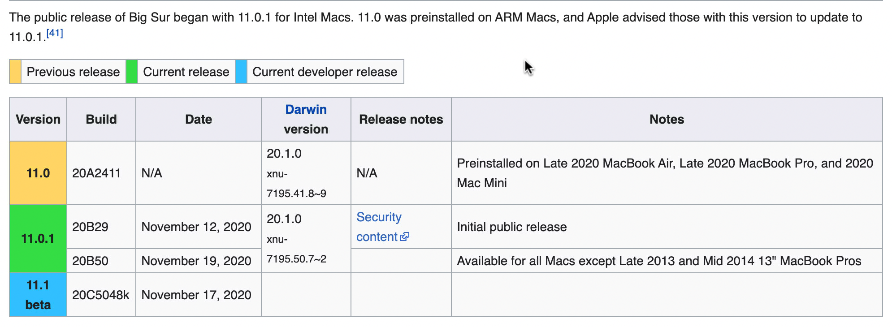
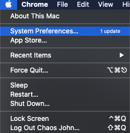
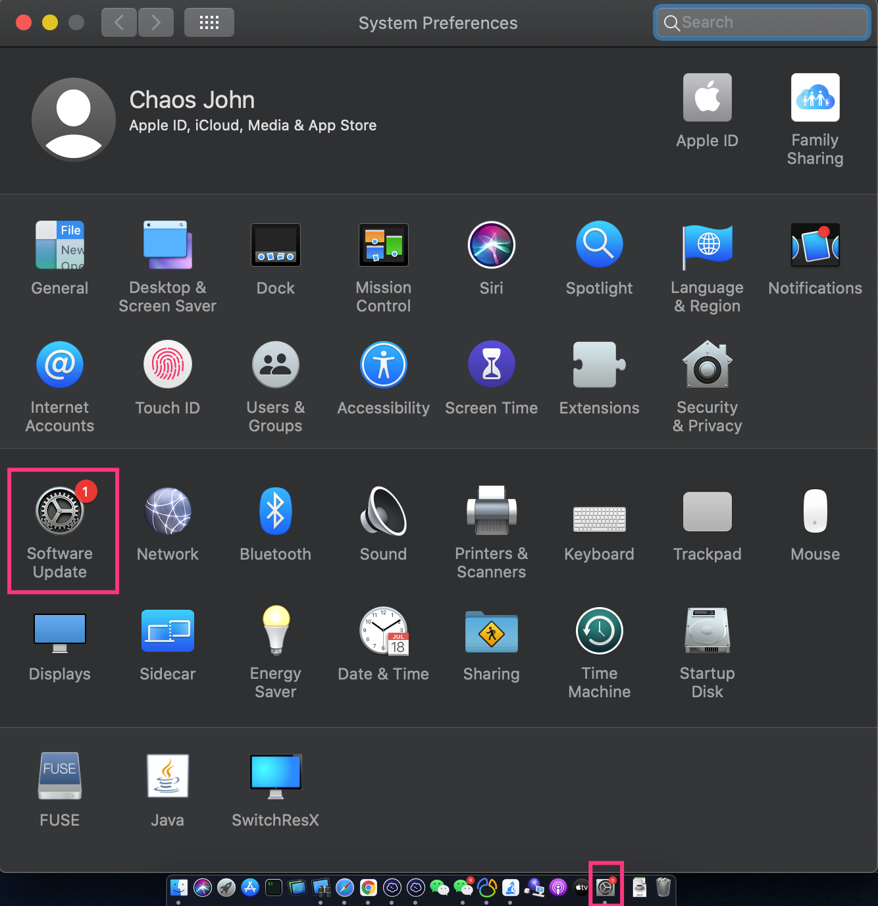

[欢迎转载，但请在开头或结尾注明原文出处【blog.chaosjohn.com】](https://blog.chaosjohn.com/Disable-Update-Badge-of-macOS.html)

近日来，苹果电脑的操作系统 *macOS Catalina* 接近了生命周期的尾声，新的操作系统 *Big Sur* 于2020年11月12日已经发布（很有意思的是正式版的首个版本号为11.0.1，而11.0.0并未对外发布，只预装在Apple M1的三台ARM新机上，详见下图，来源于维基百科）

---

笔者是Mac死忠粉，自 *Mac OS X 10.7 Lion* 开始用，经历过系统升级还需付费购买的年代（还记得当时是花了128元升级到了 *OS X 10.8 Mountain Lion* ），跨到开始免费的 *OS X 10.9 Mavericks* ，直至后来开始抛去 *OS X* 命名的 *macOS Sierra* ，然后到 *macOS High Sierra* ，只要释出第一个版本，笔者就会更新尝鲜。无奈，很明显的感觉到苹果在软件方面的“做工”越来越糙了，尝鲜用户慢慢沦为了"实验小白鼠"以及"bug反馈器"，所以后来的 *macOS Majave* 和 *macOS Catalina* ，我放弃了尝鲜，都等到*x.4*版本释出才决定更新，才堪堪感觉“可以用了”。

*macOS Big Sur* 这不刚出就被人笑成 *Bug Sur* ，笔者毅然决然不更它。

---

可是问题来了，升级提醒小红点真是逼死我了！！！还不是一处！

1. 系统左上角苹果标🍎，点击下拉菜单，在 *系统偏好设置(System Preferences)* 处提醒有更新 
2. 如果把 *系统偏好设置* 锁定在Dock栏的话，小红点+1
3. 在 *系统偏好设置* 内的 *软件更新(Software Update)* 上，小红点+2

## 解决策略
### - 系统版本 小于 *10.15.5* or 等于 *10.15.6* 
（是的，就是这么奇怪，该策略在10.15.5中被弃用了，但在10.15.6中又放出来了，之后又去掉了，[参考](https://mrmacintosh.com/10-15-5-2020-003-updates-changes-to-softwareupdate-ignore/)）

1. 关闭 *系统偏好设置*
2. 打开 *终端(Terminal)*
3. 执行 `sudo softwareupdate --ignore "macOS Big Sur"`。如果处于 *Mojave* 想阻止升级到 *Catalina*, 把命令中的 *Big Sur* 改成 *Catalina*即可。

（如果改变主意想接收更新了，执行 `sudo softwareupdate --reset-ignored`即可恢复）

### - 系统版本 等于 *10.15.5* or 大于 *10.15.6*
- 执行: `defaults write com.apple.systempreferences AttentionPrefBundleIDs 0 && killall Dock`，小红点就消失了，不再提示升级了
- 恢复: `defaults write com.apple.systempreferences AttentionPrefBundleIDs 1 && killall Dock`

---

最后，如果该文对读者有些许帮助，考虑下给点捐助鼓励一下呗😊

