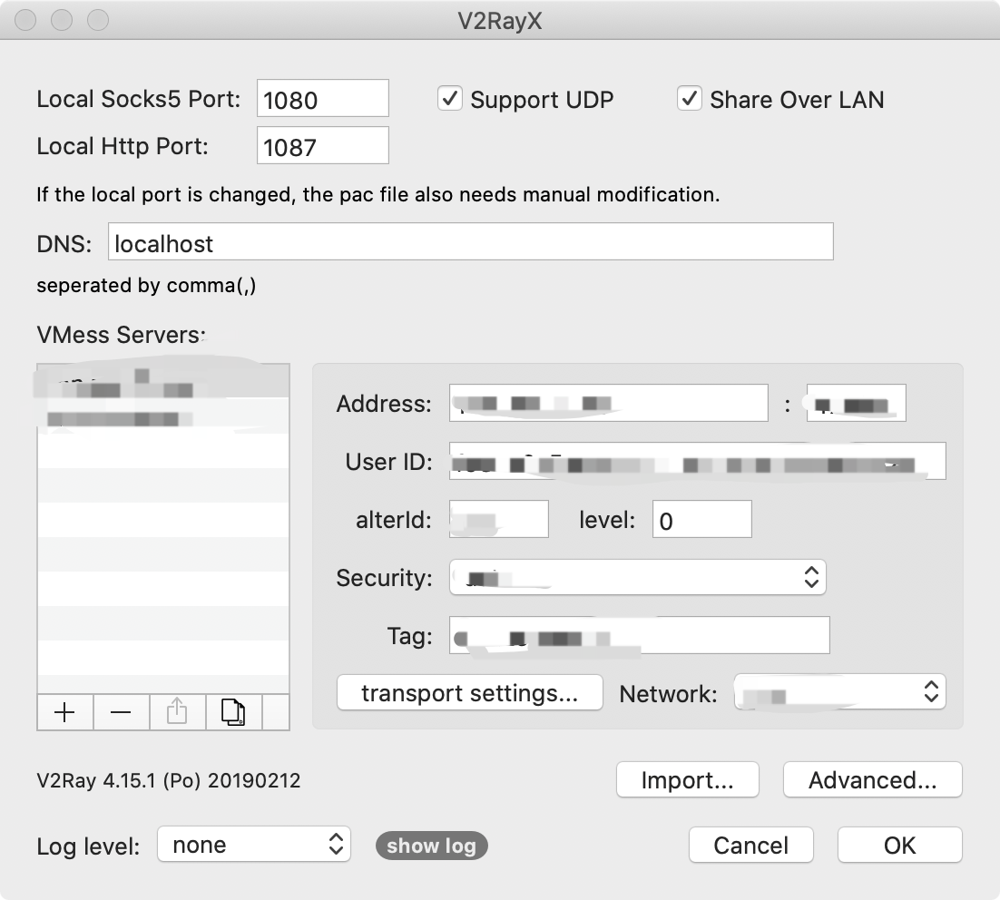
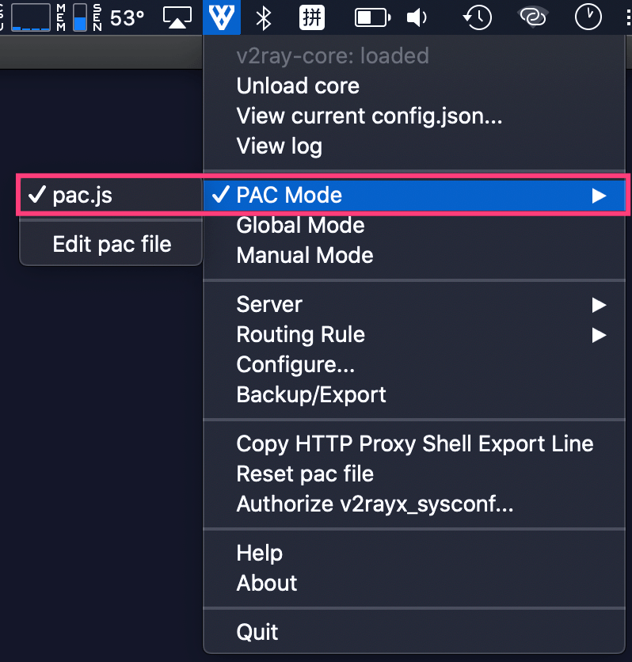
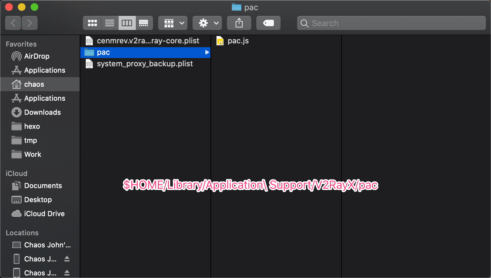

[欢迎转载，但请在开头或结尾注明原文出处【blog.chaosjohn.com】](https://blog.chaosjohn.com/Fix-PAC-mode-of-V2RayX-not-working.html)

## 问题起因
笔者在N年前就开始拿 5had0w50ck5X(-NG) 用以查资料，所以习惯了用 `1080` 作为本地 `socks5` 代理的端口号。

因为某些不可抗力因素，笔者不得不放弃该软件，转而投降 `V2RayX` 的怀抱。

真的挺好用的，除开它的 `PAC Mode` 不起作用这一点。

具体表现为，在 `Safari` 里国内网站能正常打开，但是受限网站访问不了。


## 排查问题
先上软件设置页的截图：



因为 `Global Mode` 是好使的，所以 `v2ray-core` 是没有问题的，那问题肯定出在 `PAC Mode` 本身。



点击 `Edit pac file` 会自动打开 `Finder` 并定位到 `$HOME/Library/Application Support/V2RayX/pac` 目录，该目录下只有一个文件 `pac.js`



先检查一下 `pac.js` 的内容
```
var V2Ray = "SOCKS5 127.0.0.1:1081; SOCKS 127.0.0.1:1081; DIRECT;";

var domains = [
  ...
  ...
  ...
];

function FindProxyForURL(url, host) {
    for (var i = domains.length - 1; i >= 0; i--) {
    	if (dnsDomainIs(host, domains[i])) {
            return V2Ray;
    	}
    }
    return "DIRECT";
}
```

`domains` 里存放的是需要走 *代理* 的域名，着重检查了几个，都在其中，所以排除了 **域名列表失效** 的因素。

突然我一拍脑袋的发现：

- 我在 `GUI设置` 里配置的本地 `Socks5 Port` 为 `1080`
- `pac.js` 里第一行，配置的端口却为 `1081`

这。。。要是能走通代理就奇了怪了！！！

把 `pac.js` 里的 `1081` 改为 `1080`，`PAC Mode` 就立刻正常工作了。

## 写在最后
平时发现问题之后，除了去网上查解决办法，可以先自己检查一下设置，自行排查一下原因，不仅能获得成就感，还能锻炼思维能力。

---

最后，如果该文对读者有些许帮助，考虑下给点捐助鼓励一下呗😊
