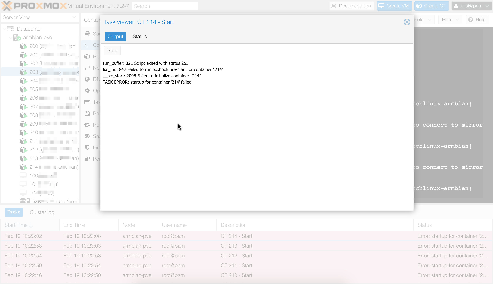
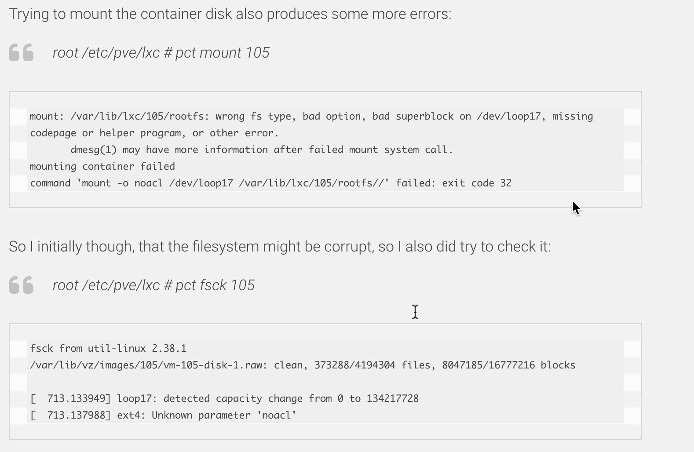
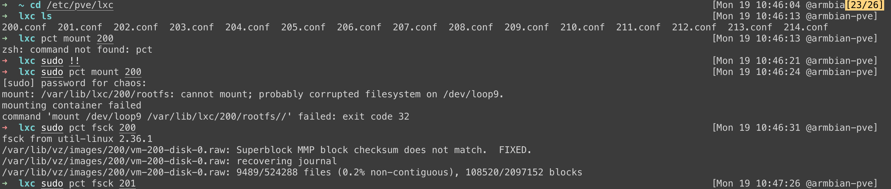

[欢迎转载，但请在开头或结尾注明原文出处【blog.chaosjohn.com】](https://blog.chaosjohn.com/Create-br0-without-losing-connection-under-Ubuntu-22-04.md)

搬新家后，终于有时间慢慢把我的设备一件一件填满我的书(ci)房(wo)。在这个过程中，突然发现我的一块安装了PVE的arm单板，上电后只有一个容器能运行，其余容器均无法启动，显示报错
```
run_buffer: 321 Script exited with status 255
lxc_init: 847 Failed to run lxc.hook.pre-start for container "214"
__lxc_start: 2008 Failed to initialize container "214"
TASK ERROR: startup for container '214' failed
```


首先先排除PVE系统故障，因为如果是故障，应该所有的容器都无法启动。
经Google搜索了一番，发现这么一个帖子[Fixing Issues after upgrading Proxmox 7 to 8](https://philipp.haussleiter.de/2023/11/fixing-issues-after-upgrading-proxmox-7-to-8/)

- 先尝试挂载容器的磁盘映像，`# pct mount <id>`
- 如果发现挂载失败，显示`wrong fs type, bad option, bad superblock on /dev/loop17, missing codepage or helper program, or other error.`，则表明磁盘映像挂了，需要修复
- 执行修复，`# pct fsck <id>`

我的情况跟帖子里显示的一模一样，估计是搬家前强制掉电，导致磁盘损坏了，按步骤修复后，所有容器均可正常启动了


---

参考资料：
- [Fixing Issues after upgrading Proxmox 7 to 8](https://philipp.haussleiter.de/2023/11/fixing-issues-after-upgrading-proxmox-7-to-8/)

---

最后，如果该文对读者有些许帮助，考虑下给点捐助鼓励一下呗😊

