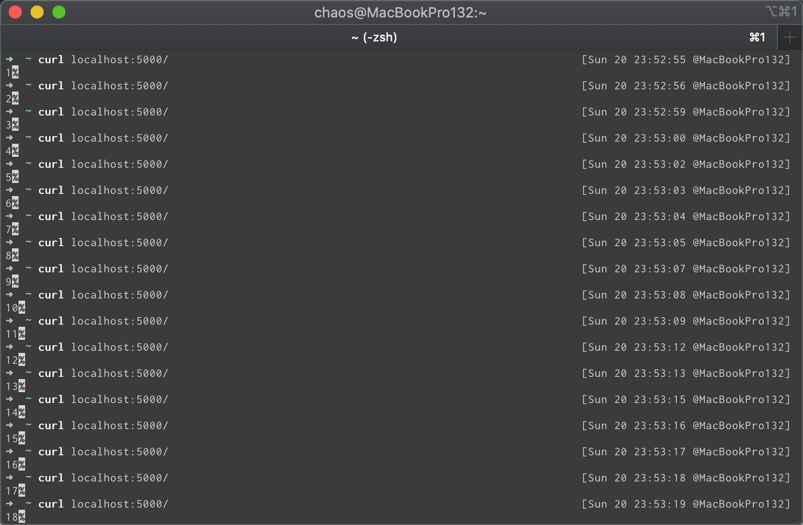

[欢迎转载，但请在开头或结尾注明原文出处【blog.chaosjohn.com】](https://blog.chaosjohn.com/Flask-with-Django-ORM.html)

## 前言
`Django` 和 `Flask` 是笔者最喜欢的两个 `Python Web` 框架，但两者定位截然不同

- Django -> "More is less": 是 **"大而全"** 的重量级 Web 框架，其自带大量的常用工具和组件（比如数据库ORM组件、用户认证、权限管理、分页、缓存), 甚至还自带了管理后台Admin，适合快速开发功能完善的企业级网站

- Flask -> "Less is more": 是一个轻便灵活又易于扩展的 **"微"** 框架，默认情况下，Django 自带的那些工具和组件，Flask 通通都没有，只提供一个非常简洁高效的 "路由组件"

平日里，做些小工具小应用啥的，笔者还是比较喜欢 **Flask** 的，借助这样小巧的微框架，数十分钟就能撸一个出来。

但是上升到写比较偏大型一点的应用，笔者一般选择的都是 **Django**。最主要的原因无非就是：它的 `ORM` 模块实在太好用了。

而在 Flask 中，用的最多 `ORM` 框架的还是 `SQLAlchemy`，但是个人感觉其友好程度比不上 `DjangoORM`。

所以笔者萌生了一个想法：`Flask + DjangoORM`

## 开工
### 手动创建项目
```
$ mkdir FlaskWithDjangoORM
```

### 用 `pip` 安装所需依赖库
```
$ pip install flask django mysqlclient
```

### 手动创建 `app` 应用
在标准的 Django 项目中，创建名为 `app` 的子应用，用到的命令为 `$ python manage.py startapp app`，该命令生成的子应用其目录下，一般会有这么几个文件/目录：

- `migrations/` 该目录存放数据库迁移文件
- `admin.py` 该文件与管理后台相关
- `apps.py` 该文件与子应用设置相关
- `models.py` 该文件存放数据库模型
- `tests.py` 该文件存放单元测试
- `views.py` 该文件存放视图层代码

但如果我们只用 `Django` 的 `ORM` 模块的话，那么只需留下 `migrations/` 和 `models.py`。故弃用命令，手动创建之：
```
$ cd FlaskWithDjangoORM
$ mkdir -p app/migrations
$ touch app/migrations/__init__.py
```

`app` 子应用初始化
```
$ cat >> app/__init__.py <<EOF
import os

from django.apps import apps
from django.conf import settings

os.environ.setdefault("DJANGO_SETTINGS_MODULE", "settings")
apps.populate(settings.INSTALLED_APPS)
EOF
```

创建数据模型 `Visit`，记录每一次 Web 请求访问的时间
```
$ cat >> app/models.py <<EOF
from django.db import models

class Visit(models.Model):
    created_at = models.DateTimeField(auto_now_add=True, null=True)
EOF
```

### 在 `settings.py` 内配置数据库连接（本文示例采用 `MySQL`）
``` 
$ cat >> settings.py <<EOF
DATABASES = {
    'default': {
        'ENGINE': 'django.db.backends.mysql',
        'NAME': 'flask-with-django-orm-sample',
        'USER': 'USERNAME',
        'PASSWORD': 'PASSWORD',
        'HOST': 'DATA_BASE_HOST',
        'PORT': '3306',
        'OPTIONS': {
            'charset': 'utf8mb4',
            # https://django-mysql.readthedocs.io/en/latest/checks.html#django-mysql-w002-innodb-strict-mode
            'init_command': "SET sql_mode='STRICT_TRANS_TABLES', innodb_strict_mode=1",
        },
    }
}

INSTALLED_APPS = ('app',)

SECRET_KEY = 'SOME_SECRET_KEY'

EOF
```

### 配置 `manage.py` 管理工具
这里从 **标准的** Django 项目中搬运过来（需略改 `setdefault` 的参数）
```
$ cat >> manage.py <<EOF
#!/usr/bin/env python
"""Django's command-line utility for administrative tasks."""
import os
import sys


def main():
    os.environ.setdefault('DJANGO_SETTINGS_MODULE', 'settings')
    try:
        from django.core.management import execute_from_command_line
    except ImportError as exc:
        raise ImportError(
            "Couldn't import Django. Are you sure it's installed and "
            "available on your PYTHONPATH environment variable? Did you "
            "forget to activate a virtual environment?"
        ) from exc
    execute_from_command_line(sys.argv)


if __name__ == '__main__':
    main()
EOF
```

至此，我们看一下目录结构：
```
.
├── app
│   ├── __init__.py
│   ├── migrations
│   │   └── __init__.py
│   └── models.py
├── manage.py
└── settings.py
```

仅这些文件，已经足以满足 `Django ORM` 运行的全部所需

### 将本地数据模型同步到数据库
创建迁移文件
```
$ python manage.py makemigrations
Migrations for 'app':
  app/migrations/0001_initial.py
    - Create model Visit
```

执行迁移
```
$ python manage.py migrate
Operations to perform:
  Apply all migrations: app
Running migrations:
  Applying app.0001_initial... OK
```

查看一下数据库
```
mysql> show databases;
+------------------------------+
| Database                     |
+------------------------------+
| flask-with-django-orm-sample |
| information_schema           |
| mysql                        |
+------------------------------+
3 rows in set (1.23 sec)
```

选择数据库并罗列所有数据库表
```
mysql> use flask-with-django-orm-sample;
Database changed

mysql> show tables;
+----------------------------------------+
| Tables_in_flask-with-django-orm-sample |
+----------------------------------------+
| app_visit                              |
| django_migrations                      |
+----------------------------------------+
2 rows in set (0.04 sec)
```

我们可以看到有一个迁移表 `django_migrations`，记录的是数据模型变更迁移的所有记录。

我们查询一下该表，可以看到已存在 `0001_initial` 这条记录，与之前运行 `makemigrations` 所生成的迁移文件 `app/migrations/0001_initial.py` 相吻合
```
mysql> select * from django_migrations;
+----+-----+--------------+----------------------------+
| id | app | name         | applied                    |
+----+-----+--------------+----------------------------+
|  1 | app | 0001_initial | 2020-12-20 08:01:16.618904 |
+----+-----+--------------+----------------------------+
1 row in set (0.22 sec)
```

看一下 `app_visit` 表结构，与我们在 `app/models.py` 里定义的 `Visit` 相吻合（Django ORM 默认创建的表名为 `子应用名_数据模型类名`）
```
mysql> desc app_visit;
+------------+-------------+------+-----+---------+----------------+
| Field      | Type        | Null | Key | Default | Extra          |
+------------+-------------+------+-----+---------+----------------+
| id         | int(11)     | NO   | PRI | NULL    | auto_increment |
| created_at | datetime(6) | YES  |     | NULL    |                |
+------------+-------------+------+-----+---------+----------------+
2 rows in set (0.25 sec)
```

### 创建 `server.py` 作为 `flask` 的主文件 
```
$ cat >> server.py <<EOF
from flask import Flask

from app.models import Visit

app = Flask(__name__)


@app.route("/")
def index():
    Visit.objects.create()
    return str(Visit.objects.count())


if __name__ == '__main__':
    app.run()
EOF
```

将 `server.py` 运行起来
```
$ python server.py
* Serving Flask app "server" (lazy loading)
 * Environment: production
   WARNING: This is a development server. Do not use it in a production deployment.
   Use a production WSGI server instead.
 * Debug mode: off
 * Running on http://127.0.0.1:5000/ (Press CTRL+C to quit)
```

### 测试效果
在新终端多次访问 `localhost:5000/`，可以看到返回从 `1` 开始依次递增


查看下程序日志 
```
 * Running on http://127.0.0.1:5000/ (Press CTRL+C to quit)
127.0.0.1 - - [20/Dec/2020 09:52:56] "GET / HTTP/1.1" 200 -
127.0.0.1 - - [20/Dec/2020 09:52:58] "GET / HTTP/1.1" 200 -
127.0.0.1 - - [20/Dec/2020 09:53:00] "GET / HTTP/1.1" 200 -
127.0.0.1 - - [20/Dec/2020 09:53:01] "GET / HTTP/1.1" 200 -
127.0.0.1 - - [20/Dec/2020 09:53:03] "GET / HTTP/1.1" 200 -
127.0.0.1 - - [20/Dec/2020 09:53:04] "GET / HTTP/1.1" 200 -
127.0.0.1 - - [20/Dec/2020 09:53:05] "GET / HTTP/1.1" 200 -
127.0.0.1 - - [20/Dec/2020 09:53:06] "GET / HTTP/1.1" 200 -
127.0.0.1 - - [20/Dec/2020 09:53:07] "GET / HTTP/1.1" 200 -
127.0.0.1 - - [20/Dec/2020 09:53:08] "GET / HTTP/1.1" 200 -
127.0.0.1 - - [20/Dec/2020 09:53:12] "GET / HTTP/1.1" 200 -
127.0.0.1 - - [20/Dec/2020 09:53:13] "GET / HTTP/1.1" 200 -
127.0.0.1 - - [20/Dec/2020 09:53:14] "GET / HTTP/1.1" 200 -
127.0.0.1 - - [20/Dec/2020 09:53:16] "GET / HTTP/1.1" 200 -
127.0.0.1 - - [20/Dec/2020 09:53:17] "GET / HTTP/1.1" 200 -
127.0.0.1 - - [20/Dec/2020 09:53:18] "GET / HTTP/1.1" 200 -
127.0.0.1 - - [20/Dec/2020 09:53:19] "GET / HTTP/1.1" 200 -
127.0.0.1 - - [20/Dec/2020 09:53:26] "GET / HTTP/1.1" 200 -
```

再检查一下数据库
```
mysql> select * from app_visit;
+----+----------------------------+
| id | created_at                 |
+----+----------------------------+
|  1 | 2020-12-20 09:52:56.660151 |
|  2 | 2020-12-20 09:52:58.761042 |
|  3 | 2020-12-20 09:53:00.393140 |
|  4 | 2020-12-20 09:53:01.811832 |
|  5 | 2020-12-20 09:53:03.216767 |
|  6 | 2020-12-20 09:53:04.471404 |
|  7 | 2020-12-20 09:53:05.639631 |
|  8 | 2020-12-20 09:53:06.790564 |
|  9 | 2020-12-20 09:53:07.823484 |
| 10 | 2020-12-20 09:53:08.836709 |
| 11 | 2020-12-20 09:53:12.069902 |
| 12 | 2020-12-20 09:53:13.293624 |
| 13 | 2020-12-20 09:53:14.799734 |
| 14 | 2020-12-20 09:53:15.993364 |
| 15 | 2020-12-20 09:53:17.022426 |
| 16 | 2020-12-20 09:53:18.141073 |
| 17 | 2020-12-20 09:53:19.499833 |
| 18 | 2020-12-20 09:53:26.608735 |
+----+----------------------------+
18 rows in set (0.02 sec)
```

日志里的访问记录和数据库里存储的访问记录，完全一致，大功告成！收工睡觉！

---

最后，如果该文对读者有些许帮助，考虑下给点捐助鼓励一下呗😊
