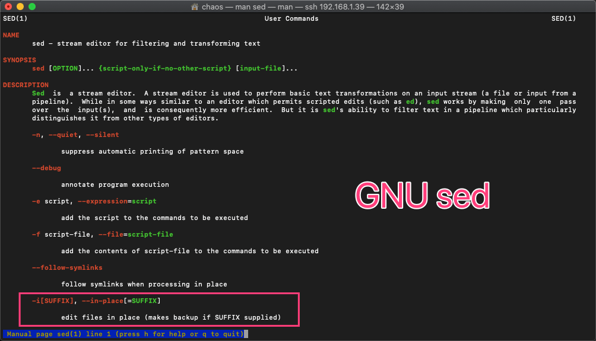
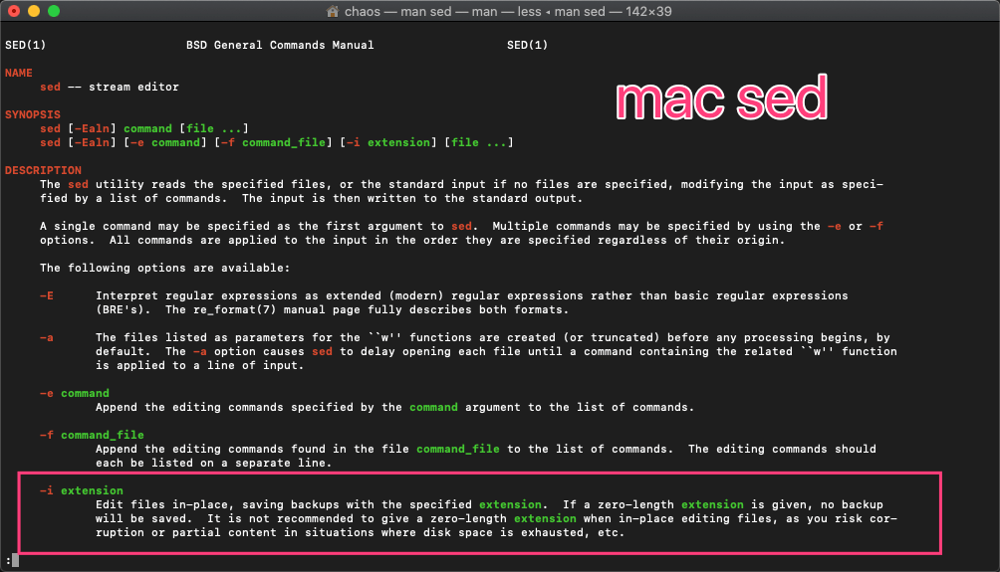

[欢迎转载，但请在开头或结尾注明原文出处【blog.chaosjohn.com】](https://blog.chaosjohn.com/GNU-sed-to-mac-sed.html)

# 前言
之前在每篇文前都标注了 `原文链接`，想着把它替换成 `转载申明`，手动一篇一篇替换是不可能的，咱可是程序员，任何批量操作都可以 `脚本化`

# 说干就干
关于文本批处理工具，首先想到的就是 `sed`，它是一个“非交互式的”面向字符流的编辑器，能同时处理多个文件多行的内容，可以不对原文件改动，把整个文件输入到屏幕,可以把只匹配到模式的内容输入到屏幕上。还可以对原文件改动，但是不会再屏幕上返回结果。

上脚本：
```
$ for file in *.md; do sed -i 's/原文链接/欢迎转载，但请在开头或结尾注明原文出处【blog.chaosjohn.com】/g' $file; done
sed: 1: "Clean-APFS-Snapshots.md": invalid command code C
sed: 1: "Comeback-in-2020.md": invalid command code C
sed: 1: "Crack-Bartender2.md": invalid command code C
sed: 1: "Debug-php.md": extra characters at the end of D command
...
```

怎么回事，全都报错了？？？

# 查找问题
关于 `sed`，平时在生产环境中也用的挺多的，`sed -i 's/旧/新/g' ${FILE}` 语法肯定没错呀。唯一不同的在于生产环境都是 `GNU/Linux`，问题肯定出在了 `macOS` 上。用 `man` 指令查看一下 `sed` 在 两个平台的 `帮助手册`



`-i` 即替换后的新文本会直接回写进原文件：
- `GNU sed` 如果在 `-i` 后添加了 `后缀`，则会备份原文件；如果不添加，则不备份
- `mac sed` 则强制性要添加 `后缀`。如果不想备份原文件，后缀置为空字符串 `''`

# 解决
原脚本修正为: 
```
$ for file in *.md; do sed -i '' 's/原文链接/欢迎转载，但请在开头或结尾注明原文出处【blog.chaosjohn.com】/g' $file; done
```

---

最后，如果该文对读者有些许帮助，考虑下给点捐助鼓励一下呗😊
