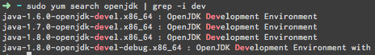

title: 解决“Gradle -- Could not find tools.jar”
date: 2016-05-30 14:48:44
tags: [Java, Gradle, Error]
---

[欢迎转载，但请在开头或结尾注明原文出处【blog.chaosjohn.com】](https://blog.chaosjohn.com/Gradle-Could-not-find-tools-jar.html)

## 错误出现的环境 
* CentOS 7 x86_64
* 已通过`sudo yum install java-1.8.0-openjdk`安装OpenJDK8
* 部署完成的Spring-Boot项目，执行`./gradlew bootRun` 
* 报错`Could not find tools.jar
* 该项目在其他的机器上均未出现该问题，包括OSX、Ubuntu和另一台CentOS

## 解决方案
* 经StackOverFlow搜索，发现[Gradle does not find tools.jar](https://stackoverflow.com/questions/11345193/gradle-does-not-find-tools-jar)和[Correct way of referencing tools.jar in a cross-platform way](https://stackoverflow.com/questions/25626757/correct-way-of-referencing-tools-jar-in-a-cross-platform-way/25628156#25628156)两篇，主要是通过改build.gradle，强制加入tools的搜寻路径来解决问题。目测有效，但是因为在其他机子上都正常运行不报错，所以放弃该方案。
* 突然想起来在很多情况下报错都是因为没有安装dev包（或devel包），比如pip安装模块却没有安装python-dev等等。就寻思着，OpenJDK会不会也要安装dev组件呢？
* 键入`sudo yum search openjdk | grep -i dev`进行搜索，果然有`java-1.8.0-openjdk-devel`
* `sudo yum install java-1.8.0-openjdk-devel`，再次`./gradlew bootRun`，成功运行不报错

## 结语
开发过程中出现问题了，不仅要勤搜索，还要勤动脑思考。最后，如果该文对读者有些许帮助，考虑下给点捐助鼓励一下呗😊

