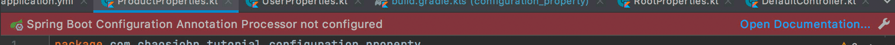
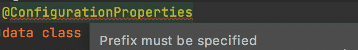
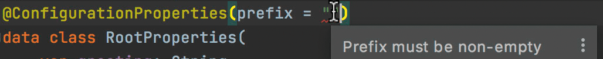

[欢迎转载，但请在开头或结尾注明原文出处【blog.chaosjohn.com】](https://blog.chaosjohn.com/source/_posts/SpringBoot-ConfigurationProperties.html)


## 背景
`SpringBoot` + `kotlin`

在 `SpringBoot` 项目中，我们经常在配置文件`application.properties` 或 `application.yml` 中存放配置参数。

网上很少有 `kotlin` 版本的使用教程/案例，所以就有了本文

## 简单场景: `@Value` 
如果只是偶尔在业务中获取一下配置值，可以使用 `@Value` 注解
```
@Value(value = "\${server.port}")
lateinit var port: String
```

需要用的地方，调用 `port` 变量直接就能访问配置文件中的 `server.port` 值

## 使用 `@ConfigurationProperties`
### 环境准备: 开启 `annotationProcessor`
如果不开启的话，`IDEA` 则会提示报错 `Spring Boot Configuration Annotation Processor not configured` 

所以，在 `build.gradle.kts` 文件的 `dependencies` 块里添加以下行 
```
dependencies {
    ...
    annotationProcessor("org.springframework.boot:spring-boot-configuration-processor")
    ...
}
```

在 `Preferences` -> `Build, Execution, Deployment` -> `Compiler` -> `Annotation Processors` 中将 `Enable annotation processing` 勾选上

### 示例 `application.yml`
```
server:
  port: 9090
greeting: Hello
greetings:
  EN: Hello
  ES: Hola
  DE: Hallo
  CN: 你好
user:
  name: Chaos
  gender: male
  age: 21
product:
  name: picture
  seller: chaos
  price: 12.3
  weight: 2
order:
  id: 1234d5
  paid: true
```

### `@ConfigurationProperties` 配置 `prefix` 
如果不指定 `prefix`，`IDEA` 会提示警告 `Prefix must be specified` 

对于 `greeting`，它的 `prefix` 为 `空`，但是如果指定为 `空字符串` 的话 `IDEA` 又会提示报错 `Prefix must be non-empty` 

所以建议使用 `多级配置`，类似于
```
user:
  name: Chaos
  gender: male
  age: 21
```
对于 `name/gender/age`，其 `prefix` 为 `user`

### 激活 `@ConfigurationProperties`
以 `UserProperties`类 举例，假设它的包名为 `com.chaosjohn.tutorial.configuration_property`，如何让 Spring 知道该类的存在呢？

有以下几种方法：

1. 增加注解 `@ConfigurationPropertiesScan`
2. 增加注解 `@EnableConfigurationProperties(value = [UserProperties::class])`
3. 在类上增加注解 `@Component`
4. 在 `@Configuration` 注解的类内手动创建 `@Bean`

### 采用 `class` 作为 Properties 类
```
@ConfigurationProperties(prefix = "product")
class ProductProperties {
    lateinit var name: String
    var seller: String = ""
    var price by Delegates.notNull<Double>()
    var weight: Int = 0
}
```

参数可以给定默认值进行初始化，但生成 `Bean` 时，会自动从配置文件读入参数值，除此以外：

- 对于非基本类型，可以用 `lateinit` 来延迟初始化
- 对于基本类型（Primitive Type，比如 `Int` / `Double` / `Boolean`），可以选用 `by Delegates.notNull<>()`

### 采用 `data class` 作为 Properties 类
```
@ConstructorBinding
@ConfigurationProperties(prefix = "user")
data class UserProperties(
    var name: String,
    var gender: String,
    var age: Int
)
```
> 注意：
> 
> `@ConstructorBinding` 必不可少
> 
> `data class` 无法手动生成 `Bean`

### 使用

- 通过构造函数传入
```
@RestController
class Controller(val userProperties: UserProperties) {
  ...
}
```

- 通过注解 `@Autowired` 注入
```
@RestController
class Controller {
  
  @Autowired
  lateinit var userProperties: UserProperties
  
  ...
}
```

### 关于 JSR303 验证
亲测无法用于 `data class`

### 示例代码
[Github: ChaosJohn/SpringBootConfigurationProperty](https://github.com/ChaosJohn/SpringBootConfigurationProperty.git)