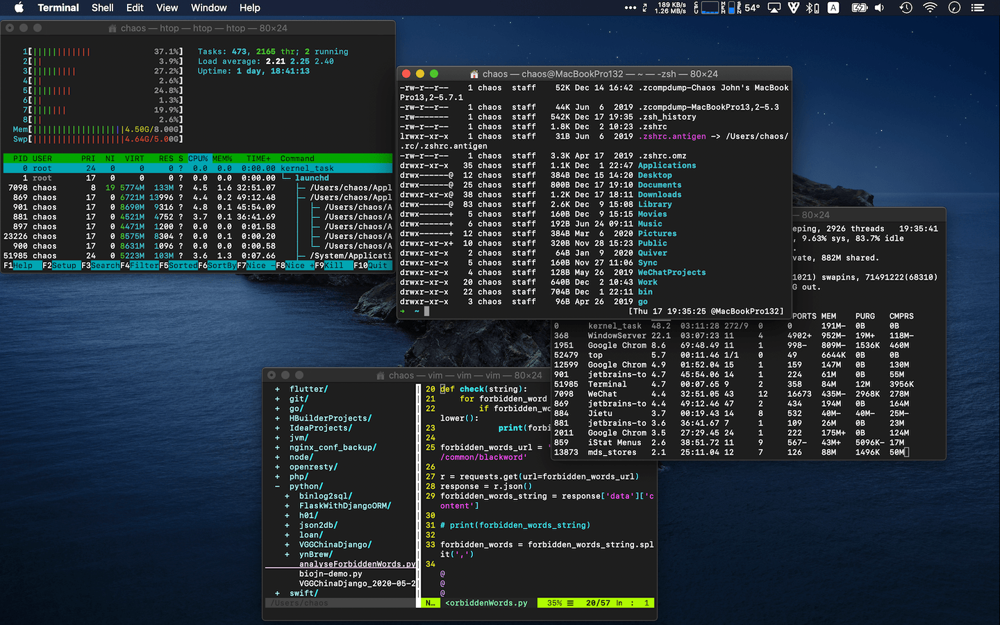
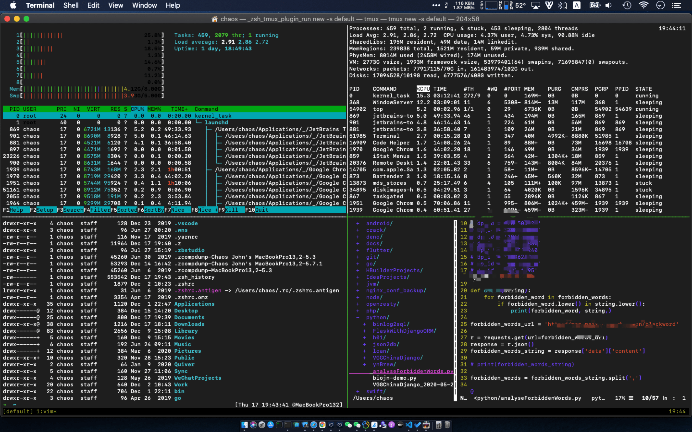
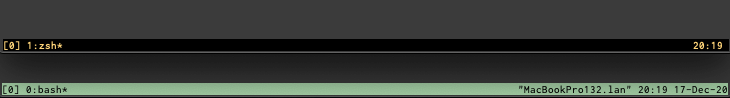

[欢迎转载，但请在开头或结尾注明原文出处【blog.chaosjohn.com】](https://blog.chaosjohn.com/my-tmux-config.html)

## 介绍
`Tmux` 是一个终端复用软件，在没有终端复用软件之前：

- 如果要同时执行多项任务，得开多个终端窗口（`Terminal`），远程的话还得在多个终端窗口里发起多条 `SSH` 连接（入下图）

- 如果在远程执行任务的时候，关闭终端，会强制性关闭 `SSH` 连接，进而导致任务执行直接中断

如果用上 `Tmux` 这样的终端复用软件后：

- 开启一个 `tmux session` 后，可以同时打开多个窗口，每个窗口可以分割为多个窗格，每个窗格都是一个 `tty`（即虚拟终端）

- 关闭终端，运行在 `tmux session` 的 `tty` 中的任务，依旧会保持运行，重新打开终端，还能连接回该 session

## 笔者自用配置
本文取名为 `“传家宝”配置`，那可不是说说而已，因为本文内的自定义配置已经陪伴了笔者6年之久了。

为什么要自定义这份配置呢？因为笔者在最初使用过程中，发现很多不顺手的快捷键，所以大部分自定义项都是跟快捷键有关的。

配置文件位于用户主目录下，文件名为 `.tmux.conf`

先说明一下，`Tmux` 的前缀键为 `ctrl-b`，即先按下 `ctrl键` 和 `b键`, `Tmux` 才开始被激活进入快捷键接受模式，比如：

- `ctrl-b` 按下后松开，再按一下 `c`，**Tmux** 就会新建窗口（create）
- `ctrl-b` 按下后松开，在按一下 `d`，**Tmux** 就会从当前窗口断开转为后台执行（detach）

### 自定义窗口下标起始
`Tmux` 可以新建很多窗口，默认窗口标号为 `0`，然后才是 `1 2 3 ...`（窗格也是）

虽然很符合程序思维，但是跟键盘上那一排数字键的顺序不吻合，所以改成 `1` 开始，然后才是 `2 3 4 ...`

```
set-option -g base-index 1
set-window-option -g pane-base-index 1
```

### 自定义快捷键：分割窗格
默认情况下：

- 水平分割：`ctrl-b` + `"`（引号键）
- 垂直分割：`ctrl-b` + `%`（百分号键）

改成 `-` 和 `|`，更符合行为逻辑

```
unbind '"'
bind - splitw -v
unbind %
bind | splitw -h 

bind-key - split-window -c "#{pane_current_path}"
bind-key | split-window -h -c "#{pane_current_path}"
```

最后两行表示，通过 `-` 和 `|` 分割出的新窗格，`shell` 的初始路径为当前路径

### 自定义快捷键：窗格间移动
默认的情况下，窗格间移动是 `ctrl-b` + `方向键`

由于笔者习惯了 `Vim` 的方向逻辑，所以也增加 `hjkl` 作为窗格间导航的快捷键（原方向键也保留）

```
bind k selectp -U
bind j selectp -D
bind h selectp -L
bind l selectp -R
```

### 自定义快捷键：调整窗格大小
使用 `ctrl-b` + `ctrl-h/j/k/l`，用来移动窗格间的分割线方向，达到调整窗口大小的目的（每次移动10行）

```
bind ^k resizep -U 10
bind ^j resizep -D 10
bind ^h resizep -L 10
bind ^l resizep -R 10
```

### 自定义状态栏的背景和前景色
默认的背景色为 `绿色`，前景色为 `黑色`，笔者分别调整为 `黑色` 和 `黄色`

```
set -g status-bg black
set -g status-fg yellow
```

效果对比入下图：


### 自定义状态栏的信息显示
默认在状态栏右侧显示 `主机名` + `时间` + `日期`

因为笔者一般使用 `oh-my-zsh`，已经配置显示了 `主机名` + `时间` + `日期`，所以改为只保留 `时间`（对比见上图）

```
set-option -g status-right "#(date +%H:%M' ')"
set-option -g status-right-length 10
```

## 配合 `oh-my-zsh` 的 `tmux 插件`
上面也说了，笔者一般使用 `oh-my-zsh`，如果开启 `tmux 插件`，`Tmux` 的使用体验又会更上一层楼。

开启方法：在 `~/.zshrc` 的 `plugins=(git)` 括号里追加 `tmux`，空格隔开

它可以：

- 将 `tmux attach -t $session_name` 缩减成 `ta $session_name`
- 将 `tmux attach -d -t $session_name` 缩减为 `tad $session_name`
- 将 `tmux list-sessions` 缩减为 `tl`

还有其他的缩减，有兴趣的同学可以前往 `oh-my-zsh` 插件目录看一眼 `tmux.plugin.zsh` 文件

---

最后，如果该文对读者有些许帮助，考虑下给点捐助鼓励一下呗😊
